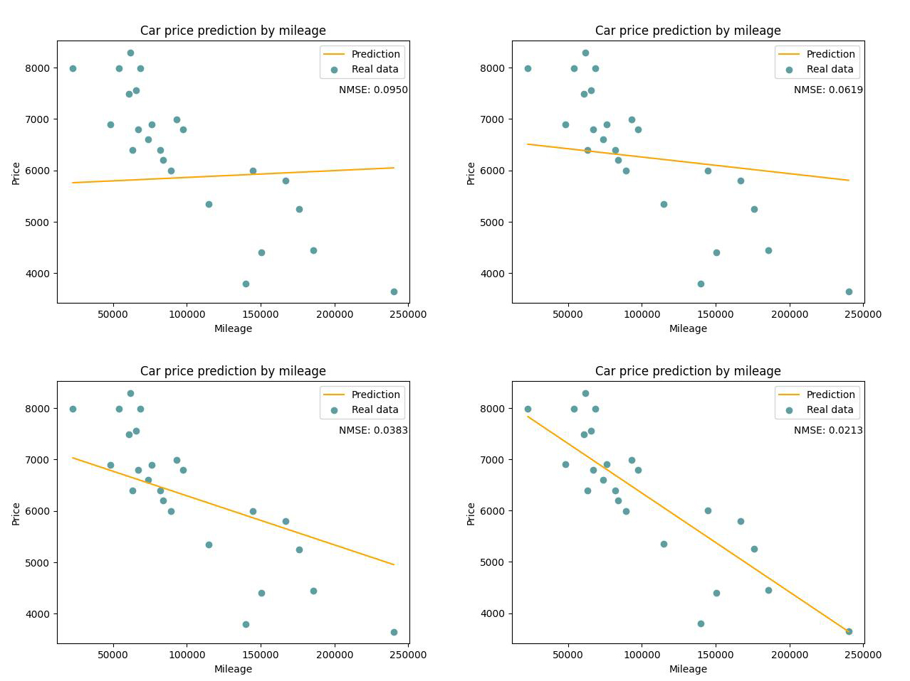

# Linear Regression

**Linear Regression** is a starting point to learn machine learning **from zero**,  
by re-implementing fundamental machine learning algorithms.

The purpose of this repository is to understand how classic ML models work internally.

---

## Highlights

- **From Zero** → Starting from no external ML frameworks, everything implemented from scratch
- **Educational** → designed as a step-by-step learning exercise  
- **Modularity** → designed as encapsulated classes, can be reused in different projects.

---

## Requirements

These projects are mainly built with Rust and Python for visualization. Therefore, some dependencies are required.  

Each project includes a `venv.sh` and `requirements.txt` to help you set up a virtual environment and install the necessary packages:  

```bash
bash venv.sh
source venv/bin/activate
```

Cargo is needed to build and run Rust program.

## Projects

The goal of this project is to predict car prices based on their mileage, as these two factors have a linear correlation.
As an introduction to machine learning, gradient descent is used to minimize the loss function (MSE) in order to find the 
appropriate values of θ₀ and θ₁. These two parameters are updated simultaneously during the process, allowing the loss 
function to descend in the steepest direction.

Linear regression is implemented with three programs, main algorithm is implemented with Rust, visualizer with python:

### Methodology

Linear regression is one of the most fundamental algorithms in machine learning. The idea is to model the relationship between an input variable (mileage) and an output variable (price) with a straight line:

$$
\hat{y} = \theta_0 + \theta_1 x
$$

where $\hat{y}$ is the predicted car price, $x$ is the mileage, and $\theta_0, \theta_1$ are parameters to be learned.

### Regression:

The regression problem can be seen as finding the best-fitting line that minimizes the difference between the predicted values $\hat{y}$ and the true values $y$.

### Normalization:

Since features may vary in scale, normalization ensures that all input data are on a comparable range. This speeds up convergence during gradient descent and prevents one feature from dominating the others.

### Loss function(Mean Squared Error, MSE):

The loss function measures how well our line fits the data:

$$
J(\theta_0, \theta_1) = \frac{1}{2m}\sum_{i=1}^m \big(\hat{y}^{(i)} - y^{(i)}\big)^2
$$

where $m$ is the number of training examples. The goal is to minimize this loss.

### Gradient Derivation (using the Chain Rule)

We want to compute the gradient of the loss with respect to each parameter.  

Start from the loss function for a single sample:  

$$
L^{(i)} = \frac{1}{2}\Big(\hat{y}^{(i)} - y^{(i)}\Big)^2
$$  

Differentiate with respect to $\hat{y}^{(i)}$:  

$$
\frac{\partial L^{(i)}}{\partial \hat{y}^{(i)}} = \hat{y}^{(i)} - y^{(i)}
$$  

Since $\hat{y}^{(i)} = \theta_0 + \theta_1 x^{(i)}$, apply the chain rule:  

For $\theta_0$:  

$$
\frac{\partial L^{(i)}}{\partial \theta_0} 
= \frac{\partial L^{(i)}}{\partial \hat{y}^{(i)}} \cdot \frac{\partial \hat{y}^{(i)}}{\partial \theta_0} 
= \big(\hat{y}^{(i)} - y^{(i)}\big)\cdot 1
$$  

For $\theta_1$:  

$$
\frac{\partial L^{(i)}}{\partial \theta_1} 
= \frac{\partial L^{(i)}}{\partial \hat{y}^{(i)}} \cdot \frac{\partial \hat{y}^{(i)}}{\partial \theta_1} 
= \big(\hat{y}^{(i)} - y^{(i)}\big)\cdot x^{(i)}
$$  

Extending to all $m$ samples (averaging):  

$$
\frac{\partial J}{\partial \theta_0} = \frac{1}{m}\sum_{i=1}^m \Big(\hat{y}^{(i)} - y^{(i)}\Big)
$$  

$$
\frac{\partial J}{\partial \theta_1} = \frac{1}{m}\sum_{i=1}^m \Big(\hat{y}^{(i)} - y^{(i)}\Big)x^{(i)}
$$  

Thus, the gradient is derived directly from the chain rule.  

#### Gradient descent:

The parameters are updated iteratively using:

$$
\theta_j := \theta_j - \alpha \frac{\partial J}{\partial \theta_j}
$$

where $\alpha$ is the learning rate that controls the step size.

### Programs

1. **Predictor**  
   - Usage:  
     ```
     cargo run <weight.txt>
     ```  
   - Reads model parameters from `weight.txt`.  
   - If no `weight.txt` is available, it uses default weights `(0, 0)`.  
   - Outputs the predicted price for the given `km` value.  

2. **Trainer**  
   - Usage:  
     ```
     cargo run <data.csv>
     ```  
   - Takes a CSV file containing training data (`km`, `price`).  
   - Trains the linear regression model using gradient descent.  
   - Saves the final model parameters into `weight.txt`.  

3. **Visualizer**  
   - Usage:  
     ```
     python visualize.py <path_to_training_program> <path_to_data_csv>
     ```  
   - Runs the Rust training program, collects the results,  
     and visualizes the training process and regression line using Python (matplotlib).  

   

---

## License
This project is licensed under the MIT License - see the [LICENSE](LICENSE) file for details.
